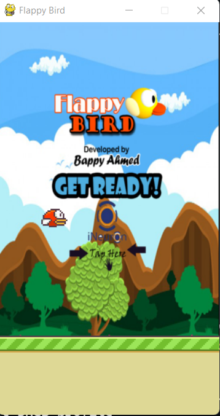

# Flappy-Bird-Mobile-Game-using-PyGame
Flappy Bird is a mobile game developed by Vietnamese video game artist and programmer Dong Nguyen, under his game development company .Gears. The game is a side-scroller where the player controls a bird, attempting to fly between columns of green pipes without hitting them.



# How to run?
### STEPS:

Clone the repository

```bash
https://github.com/entbappy/Flappy-Bird-Mobile-Game-using-PyGame.git
```
### STEP 01- Create a conda environment after opening the repository

```bash
conda create -n flappyGame python=3.7.10 -y
```

```bash
conda activate flappyGame
```


### STEP 02- install the requirements
```bash
pip install -r requirements.txt
```

### STEP 03- run app.p
```bash
python app.py
```


# Demo:


## Built With

1. pygame 
2. Python


## Authors
iNeuron Private limited
## License

This project is licensed under the MIT License - see the [LICENSE.md](LICENSE.md) file for details
